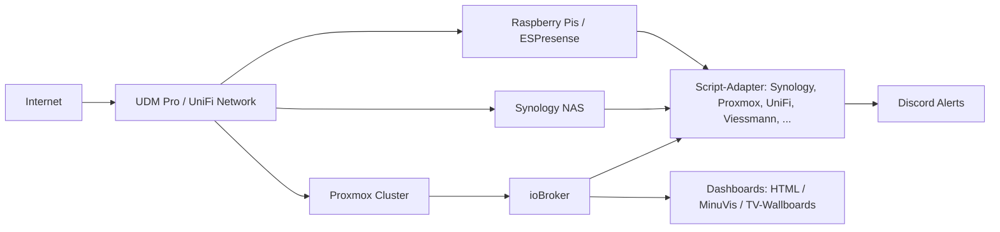

<h1 align="center">Hi, ich bin Ilovegym66 👋</h1>

  Homelab- & Smart-Home-Enthusiast · ioBroker · Proxmox · UniFi · Synology · Monitoring

  
  

---

## 🚀 Kurzüberblick

- Vollständig skriptbasierte **ioBroker-Adapter-Ersatz-Skripte** (Synology, Viessmann, Proxmox, UniFi, u.v.m.)
- **Homelab** auf Proxmox-Cluster mit Ceph, NAS, LXC/VM-Mix und Nischen-Hardware
- Eigene **Dashboards** (HTML/CSS, MinuVis, Default-1 Theme) für Monitoring & Automation
- Zentrale **Notifications** (Discord) für alle Systeme

---

## 🧰 Tech-Stack

  
  
  
  
  
  
  

---

## 🏗 Homelab-Architektur (Überblick)

---

## 📊 Monitoring & Dashboards

- **Proxmox-/Ceph-Dashboards** in ioBroker mit HTML/CSS
- **UniFi-Network-Dashboards** (Clients, APs, Switches, Traffic, VLANs)
- **Heizung & Energie** (Viessmann + Oilfox) mit Live- und Historien-Darstellung
- **Backup-/Device-Watcher-Dashboards** für Hosts, Backups, Status & Fehler
- Anzeige auf **Wallboards / TV** via MinuVis und eigene Themes (Default-1)

---

## 🧩 ioBroker Script-Adapter (Auswahl)

| Name                        | Bereich              | Kurzbeschreibung                                                |
|-----------------------------|----------------------|-----------------------------------------------------------------|
| Synology DSM Script         | NAS / Selfhosted     | DSM-API, Volumes, Shares, VMM, Backups, Snapshots, Dashboards  |
| Synology Photos Script      | Medien               | Photos-API, Index, Slideshow, Thumbnails via Webadapter        |
| Viessmann API Script        | Heizung / Energie    | Vitodens + Oilfox, Live-Werte, Historie & HTML-Dashboard       |
| UniFi Network Script        | Netzwerk             | APs, Switches, Clients, PoE, VLANs, Discord-Alerts             |
| Proxmox Script              | Virtualisierung      | Cluster, Nodes, VMs/LXCs, Ceph-Status, Control-Funktionen      |
| Linux-Control Script        | Server / Hosts       | SSH-basierte Steuerung + Monitoring (Updates, Status, Dienste) |
| Fritz!DECT Script           | Smart Home           | AIN-basierte Geräte, Schalten, Verbrauch, Temperaturen         |
| Tagesschau/News Script      | Info / Media         | Livestreams (HLS/YouTube), News-Ticker, Fallback-Handling      |
| ESPresense Distance         | Presence             | Distanz-/Room-Aggregation, Präsenztexte, Zusatz-States         |
| Worx/Landroid MQTT Script   | Garten               | MQTT-Steuerung, Status & Limits für Mäher                      |
| Hyundai Ioniq 5 N Script    | Auto / Bluelink      | Status, Ladung, Remote-Funktionen via API-Bridge               |
| DeLonghi Eletta Script      | Geräte               | Kaffeeautomat-Steuerung via API/MQTT                           |
| SwitchBot Candle Script     | Geräte               | Kerzenwärmer (Cloud-API), Power & Status                       |
| Discord Notify / Alerts     | Kommunikation        | Zentrale Discord-Benachrichtigungen für alle Systeme           |
| Backup & Device Watcher     | Monitoring           | Backup-Monitoring, Device-Watcher, HTML-Dashboards             |

---

## 🧱 Framework & Tools

<b>Default-1 Theme & Dashboard-Framework</b>

- Zentrales **Default-1 Theme** für HTML/CSS-Dashboards (Farben, Badges, Layout)
- Wiederverwendbare **Komponenten**: Cards, Progressbars, Badges, Tabellenlayouts
- Einsatz in vielen Dashboards: Proxmox, UniFi, Viessmann, Backup, Battery, Device-Watcher u.v.m.

<b>Global-Tools & Helper</b>

- Gemeinsames **Global-Tools-Script** für alle Adapter-Ersatz-Skripte:
  - `ensureState` / `safeSet` / Write-Limiter
  - Heartbeat-States pro Script
  - Logging & Debugging
- Vereinheitlichte **State-Strukturen** unter `0_userdata.0.*`

<b>Notification-Engine</b> (Discord & Co.)

- Zentrale **Discord-Integration** für:
  - Proxmox/Host-Status
  - UniFi-Events (Clients, Geräte)
  - Backups, Fehler, Warnungen
  - Kamera-/Snapshot-Events
- Flexible **Channels & Routing**, inkl. Entprellung und Deduplication

---

## ⭐ Projekte & Repos

Aktuelle öffentliche Repos (Auszug):

- 📁 **iobroker-dashboard-home**  
  Sammlung von Dashboard-Templates, HTML/CSS-Komponenten und Beispiel-Setups für ioBroker.  
  → https://github.com/Ilovegym66/iobroker-dashboard-home

---

## 📈 GitHub Overview

  
  

---

## 📫 Kontakt

- 💡 Fragen gerne direkt über Issues in den jeweiligen Repos  
- 💬 Austausch zu Homelab / ioBroker / Proxmox / UniFi jederzeit willkommen
