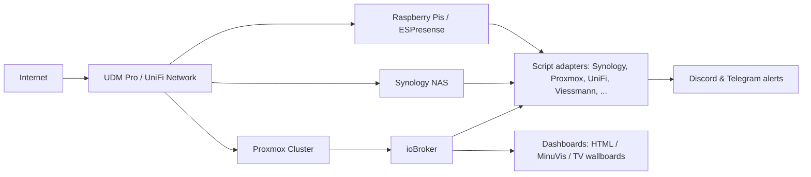

<h1 align="center">Hi, I'm Ilovegym66 👋</h1>

  Homelab & Smart Home Enthusiast · Systems & Network Engineer · Monitoring & Automation

  
  

---

## 🚀 Quick overview

- Fully script-based **ioBroker adapter replacements** (Synology, Viessmann, Proxmox, UniFi and more)
- **Homelab** on a Proxmox cluster with Ceph, NAS, LXC/VM mix and niche hardware
- Custom **dashboards** (HTML/CSS, MinuVis, Default-1 theme) for monitoring & automation
- Long-term experience as **ICT / OCC Engineer** in mission-critical environments 
- **Network engineering** background with focus on VoIP / intercom and secure connectivity
- Central **notifications** (Discord, Telegram) for infrastructure, devices and scripts

---

## 🧰 Tech stack

  
  
  
  
  
  
  
  
  
  
  
  
  
  
  
  
  

---

## 🧠 Skills

### Programming & scripting
- JavaScript for ioBroker (adapter-replacement scripts, dashboards, helper libraries)
- Bash / shell scripting for Linux automation and SSH-based control
- Python for tooling and integration work
- JSON / YAML for configs, APIs and dashboards

### Home automation & IoT
- ioBroker (custom script adapters, `0_userdata.0` structures, VIS/HTML dashboards)
- MQTT integrations (Zigbee2MQTT, Worx/Landroid, device telemetry)
- ESPresense-based presence detection and distance evaluation
- Smart devices: Fritz!DECT, SwitchBot, DeLonghi coffee machines, Worx mower, Hyundai Bluelink, Oilfox, Viessmann, etc.

### Infrastructure & homelab
- Proxmox VE (cluster setup, Ceph, LXC/VM lifecycle management)
- Red Hat / CentOS / Debian on physical and virtual hosts
- Docker & containerized services, including monitoring and automation stacks
- Synology NAS (DSM, Photos, Surveillance Station, backup strategies)

### Networking, VoIP & security
- UniFi stack (UDM Pro, APs, switches, VLANs, Wi-Fi clients)
- Network bonding, routing, IPv4/IPv6, firewalling (incl. Cisco)
- VoIP & intercom systems (SIP, RTP, signalling, integration into monitoring)
- VPN, secure remote access and segmentation for homelab and production
- Practical experience in network and information security for critical systems

### Monitoring, observability & operations
- Zabbix for host and service monitoring
- Grafana / HTML / MinuVis dashboards for system & device health
- Backup monitoring, device watcher, **script heartbeat monitoring**
- Incident response, troubleshooting and escalation in mission-critical environments

### Methods & collaboration
- Scrum & agile methods in infrastructure and automation projects
- IT service management with ITIL 4 principles
- Git & GitHub (scripts, dashboards, documentation)
- Documentation and visualization of complex homelab & automation setups

---

## 🏗 Homelab architecture (high level)

---

## 📊 Monitoring & dashboards

- **Proxmox / Ceph dashboards** in ioBroker with HTML/CSS
- **UniFi Network dashboards** (clients, APs, switches, traffic, VLANs)
- **Heating & energy** (Viessmann + Oilfox) with live and history views
- **Backup & device watcher dashboards** for hosts, backups, status & errors
- **Script monitor dashboard** for heartbeat states and script health
- Shown on **wallboards / TVs** via MinuVis and custom Default-1 themed layouts

---

## 🧩 ioBroker script adapters (selection)

| Name                        | Domain               | Short description                                              |
|-----------------------------|----------------------|----------------------------------------------------------------|
| Synology DSM Script         | NAS / self-hosted    | DSM API, volumes, shares, VMM, backups, snapshots, dashboards |
| Synology Photos Script      | Media                | Photos API, index, slideshow, thumbnails via Web adapter      |
| Viessmann API Script        | Heating / energy     | Vitodens + Oilfox, live values, history & HTML dashboard      |
| UniFi Network Script        | Network              | APs, switches, clients, PoE, VLANs, Discord alerts            |
| Proxmox Script              | Virtualization       | Cluster, nodes, VMs/LXCs, Ceph status, control functions      |
| Linux-Control Script        | Servers / hosts      | SSH-based control & monitoring (updates, status, services)    |
| Fritz!DECT Script           | Smart home           | AIN based devices, switching, consumption, temperatures       |
| Tagesschau / News Script    | Info / media         | Livestreams (HLS/YouTube), news ticker, fallback handling     |
| ESPresense Distance         | Presence             | Distance/room aggregation, presence texts, extra states       |
| Worx / Landroid MQTT Script | Garden               | MQTT control, status & limits for mower                       |
| Hyundai Ioniq 5 N Script    | Car / Bluelink       | Status, charging, remote functions via API bridge             |
| DeLonghi Eletta Script      | Devices              | Coffee machine control via API/MQTT                           |
| SwitchBot Candle Script     | Devices              | Candle warmer (Cloud API), power & status                     |
| Discord Notify / Alerts     | Communication        | Central Discord notifications for all systems                 |
| Backup & Device Watcher     | Monitoring           | Backup monitoring, device watcher, HTML dashboards            |
| Script Monitor & Heartbeat  | Meta / scripts       | Central script monitoring, heartbeat states & health checks   |

- 🧩 LG ThinQ Connect Script → [iobroker-Devices-Scripts/lg-thinq-connect](https://github.com/Ilovegym66/iobroker-Devices-Scripts/tree/main/lg-thinq-connect)

---

## 🩺 Script monitoring

A dedicated **script monitor / heartbeat** setup keeps track of all major ioBroker scripts:

- Each script reports a **heartbeat state** (`alive`, timestamp, last error).
- A central monitor aggregates the states and
  - marks unhealthy or stalled scripts,
  - raises warnings if heartbeats are missing,
  - can trigger **Discord/Telegram notifications** for script failures.
- Common conventions:
  - Heartbeat states under `0_userdata.0.*.Scripts.*`
  - Unified naming for easier dashboard integration.
- Dashboards show at a glance:
  - Which scripts are running,
  - Last execution time,
  - Error counters and status badges.

---

## 🧱 Framework & tools

<b>Default-1 theme & dashboard framework</b>

- Central **Default-1 theme** for HTML/CSS dashboards (colors, badges, layout)
- Reusable **components**: cards, progress bars, badges, table layouts
- Used across many dashboards: Proxmox, UniFi, Viessmann, backup, battery, device watcher and more.

<b>Global tools & helpers</b>

- Shared **Global-Tools script** for all adapter-replacement scripts:
  - `ensureState` / `safeSet` / write limiter
  - Heartbeat states per script
  - Logging & debugging helpers
- Unified **state structures** under `0_userdata.0.*`

<b>Notification engine</b> (Discord, etc.)

- Central **Discord integration** for:
  - Proxmox/host status
  - UniFi events (clients, devices)
  - Backups, errors, warnings
  - Camera/snapshot events
- Flexible **channels & routing**, including deduplication and de-bouncing

---

## 🎓 Certifications (selection)

- **Incident Response and Digital Forensics** – IBM (2024/2025)  
- **Red Hat Certified System Engineer (EX300)**   
- **Red Hat Certified System Administrator (EX200)** (Deploy/Configure/Manage; File Access/Storage/Security)  
- **Red Hat Certified Engineer (EX294)** – Foundations of Ansible  
- **Linux System Engineer: Network Bonding, IPv6, Routing & Virtual Systems**  
- **Scrum Master – LinkedIn Learning**  
- **Intro to Service Management with ITIL® 4 – LinkedIn Learning**  
- **CCNA (Cisco Certified Network Associate)** – course & certification prep (Udemy, 2020)  

---

## ⭐ Projects & repos

Selected public repositories:

- 📁 **iobroker-dashboard-home**  
  Collection of dashboard templates, HTML/CSS components and example setups for ioBroker.  
  → https://github.com/Ilovegym66/iobroker-dashboard-home
- 🧩 LG ThinQ Connect Script
  → [iobroker-Devices-Scripts/lg-thinq-connect](https://github.com/Ilovegym66/iobroker-Devices-Scripts/tree/main/lg-thinq-connect)
---

## 📈 GitHub overview

  
  

---

## 🌐 Community

- 🇩🇪 Organizer / member of the **ioBroker Stammtisch Rhein-Main** (Discord)
  - German-speaking community for smart home, ioBroker and homelab topics  
  - Join via Discord: https://discord.gg/yC65zjr5uq

---

## 📫 Contact

- 💡 Questions welcome via issues in the respective repos  
- 💬 Happy to talk about homelabs / ioBroker / Proxmox / UniFi / Red Hat / networking anytime
