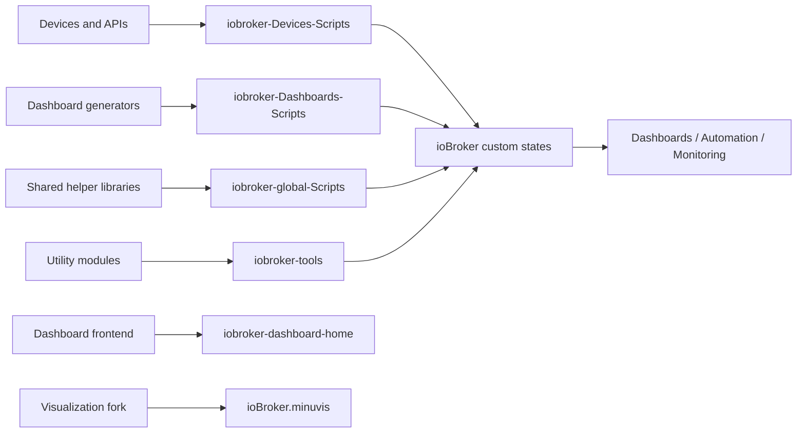

<h1 align="center">Hi, I'm Ilovegym66 👋</h1>

  Systems & Network Engineer (VoIP / Intercom) · ioBroker Script Developer · Homelab & Smart Home Enthusiast

  
  

---

## 🚀 Quick overview

- I build **script-first ioBroker integrations**, **dashboard generators**, and **global helper libraries**
- My focus is on **readable JavaScript**, **custom state models**, and **adapter replacement scripts**
- I run a heavily customized **homelab / smart-home stack** with dashboards, monitoring and automation
- My background combines **systems engineering**, **network engineering**, **VoIP / intercom**, and **operations**
- I publish my work as reusable repositories for **devices**, **dashboards**, **global libraries**, and **tools**

---

## 🧰 Tech stack

  
  
  
  
  
  
  
  
  
  
  
  
  
  
  
  
  

---

## 🧠 Skills

### Programming & scripting
- JavaScript for the ioBroker JavaScript adapter
- Bash / shell scripting for Linux automation
- Python for tooling and integration support
- JSON / YAML for configs, APIs and dashboards

### Home automation & IoT
- ioBroker custom scripts and adapter replacements
- MQTT integrations and message-driven automations
- Zigbee2MQTT-oriented structures and device bridging
- Smart-device integrations across cloud APIs, local services and BLE

### Infrastructure & homelab
- Proxmox VE, virtual machines and containers
- Synology NAS ecosystems and related APIs
- Dockerized services for monitoring, tools and integrations
- Dashboard-first state structures for custom UIs

### Networking, VoIP & security
- Network engineering with focus on **VoIP / intercom**
- UniFi, VLANs, routing, segmentation, firewalling
- Cisco-oriented networking background
- Practical experience in secure connectivity and critical environments

### Monitoring, observability & operations
- Zabbix and custom dashboard-based observability
- Script heartbeat / health reporting
- Alerting and notification routing
- Incident handling and operational troubleshooting

### Methods & collaboration
- Scrum / agile ways of working
- ITIL-oriented service thinking
- GitHub-based publication and documentation
- Pragmatic engineering with reusable building blocks

---

## 🏗 Homelab / repository landscape

```mermaid
graph LR
  A[Devices and APIs] --> B[iobroker-Devices-Scripts]
  C[Dashboard generators] --> D[iobroker-Dashboards-Scripts]
  E[Shared helper libraries] --> F[iobroker-global-Scripts]
  G[Utility modules] --> H[iobroker-tools]
  I[Dashboard frontend] --> J[iobroker-dashboard-home]
  K[Visualization fork] --> L[ioBroker.minuvis]
  B --> M[ioBroker custom states]
  D --> M
  F --> M
  H --> M
  M --> N[Dashboards / Automation / Monitoring]
```

---

## 📦 Current public repositories

| Repository | Purpose | Highlights |
|------------|---------|------------|
| [Ilovegym66](https://github.com/Ilovegym66/Ilovegym66) | Profile / overview | Main profile README, skills, architecture, certifications, community links |
| [iobroker-Devices-Scripts](https://github.com/Ilovegym66/iobroker-Devices-Scripts) | Device & adapter replacement scripts | LG ThinQ, Synology DSM, Technitium, Viessmann, Zigbee2MQTT, Xiaomi Roborock, MELK BLE Stripe |
| [iobroker-Dashboards-Scripts](https://github.com/Ilovegym66/iobroker-Dashboards-Scripts) | Dashboard generator scripts | EnergyInfo, crypto_prices, DeLonghi, Synology Photos |
| [iobroker-global-Scripts](https://github.com/Ilovegym66/iobroker-global-Scripts) | Shared global helper libraries | `global-tools.js`, `_lib_Voice_GPT.js` |
| [iobroker-tools](https://github.com/Ilovegym66/iobroker-tools) | Utility / helper scripts | `iPhone-Alarm` and related tooling |
| [iobroker-dashboard-home](https://github.com/Ilovegym66/iobroker-dashboard-home) | Full dashboard frontend | Lightweight web UI using `ioBroker.ws`, plain JavaScript/CSS, config/editor/schema/tools |
| [ioBroker.minuvis](https://github.com/Ilovegym66/ioBroker.minuvis) | Visualization fork | Customized fork of MinuVis used as a dashboard base |

---

## 🧩 Published repository content

### 1) ioBroker Devices Scripts
**Repo:** [`iobroker-Devices-Scripts`](https://github.com/Ilovegym66/iobroker-Devices-Scripts)

JavaScript-based adapter replacements and direct device / API integrations for ioBroker.

**Current top-level modules:**

| Module | Folder | Notes |
|--------|--------|-------|
| LG ThinQ Connect | `lg-thinq-connect` | ThinQ Connect PAT-based integration for refrigerator / washer / dryer style devices |
| Synology DSM | `synologyDSM` | Synology DSM API monitoring / control helpers |
| Technitium API | `technitium` | Technitium DNS Server API integration |
| Viessmann | `viessmann` | Viessmann-related integration scripts |
| Zigbee2MQTT bridge | `zigbee2mqtt` | Script-based MQTT → ioBroker bridge approach |
| Xiaomi Roborock | `xiaomi-roborock` | Roborock-related integration module |
| MELK BLE Stripe | `MELK_BLE_Stripe` | BLE-based LED / stripe control and monitoring |

**General design goals:**

- Script-first integrations
- Easy inspection and customization
- Good fit for `0_userdata.0.*` state trees
- Dashboard-friendly state models
- Secret handling outside of published code

---

### 2) ioBroker Dashboards Scripts
**Repo:** [`iobroker-Dashboards-Scripts`](https://github.com/Ilovegym66/iobroker-Dashboards-Scripts)

Dashboard-oriented scripts for ioBroker, intentionally built without Grafana.

**Current modules:**

| Module | Folder | Notes |
|--------|--------|-------|
| EnergyInfo | `EnergyInfo` | Public energy / power related data dashboard script |
| Crypto Prices | `crypto_prices` | CoinGecko-based crypto prices, threshold alerts and compact VIS widget |
| DeLonghi | `deLonghi` | Dashboard / statistics script for DeLonghi Eletta coffee machines |
| Synology Photos | `synologyPhotos` | Random photos, statistics and image states for visual dashboards |

**Typical targets:**

- VIS
- vis2
- Jarvis
- Lovelace-style dashboards
- MinuVis-style installations

---

### 3) ioBroker Global Scripts
**Repo:** [`iobroker-global-Scripts`](https://github.com/Ilovegym66/iobroker-global-Scripts)

Reusable global helper libraries for the ioBroker JavaScript adapter.

**Current files:**

| File | Purpose |
|------|---------|
| `global-tools.js` | Global helper toolbox used across many other scripts |
| `_lib_Voice_GPT.js` | Global helper library for GPT / voice-related scripts |

**Global-Tools includes helpers for:**

- logging
- state creation / safe writes
- formatting helpers
- date / time helpers
- JSON helpers
- array helpers
- HTML escaping
- heartbeat / health reporting
- SynoChat notifications

> These global libraries are designed to be side-effect free: no schedules, no polling loops and no `on()` listeners of their own.

---

### 4) ioBroker Tools
**Repo:** [`iobroker-tools`](https://github.com/Ilovegym66/iobroker-tools)

A compact utility repository for ioBroker-related helper tooling.

**Current content:**

| Module | Folder | Notes |
|--------|--------|-------|
| iPhone Alarm | `iPhone-Alarm` | Utility module around MQTT / Apple / iPhone / Shortcuts style use cases |

---

### 5) ioBroker Dashboard Home
**Repo:** [`iobroker-dashboard-home`](https://github.com/Ilovegym66/iobroker-dashboard-home)

A lightweight dashboard frontend that connects to ioBroker via the **ioBroker.ws adapter** and uses plain JavaScript and CSS.

**Repository structure currently includes:**

- `assets`
- `data`
- `doc/img`
- `editor`
- `schema`
- `tools`
- `config.json`
- `config_prod.json`
- `gulpfile.js`
- `index.html`
- `package.json`

**Project characteristics:**

- Framework-light approach
- Web dashboard frontend
- Separate config files
- Editor and schema support

---

### 6) ioBroker MinuVis
**Repo:** [`ioBroker.minuvis`](https://github.com/Ilovegym66/ioBroker.minuvis)

A public fork of MinuVis used as one of the foundations for customized dashboard work.

**Focus:**

- visualization
- dashboard presentation
- ioBroker UI customization

---

## 📈 What ties these repositories together

Across these repos, the recurring themes are:

- **ioBroker-first development**
- **Readable JavaScript instead of black-box integrations**
- **Dashboard-friendly state structures**
- **Portable scripts for custom environments**
- **Monitoring, heartbeat and notification awareness**
- **Pragmatic engineering over unnecessary complexity**

---

## 🎓 Certifications & training

- **Red Hat Certified System Engineer (EX300)** – certification preparation
- **Red Hat Certified System Administrator (EX200)** – preparation tracks
- **Red Hat Certified Engineer (EX294)** – foundations of Ansible
- **Linux System Engineer: Network Bonding, IPv6, Routing & Virtual Systems**
- **Scrum Master – LinkedIn Learning**
- **Intro to Service Management with ITIL® 4 – LinkedIn Learning**
- **CCNA (Cisco Certified Network Associate)** – course / certification prep (Udemy, 2020)
- **Incident Response and Digital Forensics** – IBM (2024/2025)

---

## 🌐 Community

- 🇩🇪 Organizer / member of the **ioBroker Stammtisch Rhein-Main** (Discord)
  

  

## Willkommen beim ioBroker Stammtisch Rhein-Main 👋

📅 Monatliche Treffen, Smart Home Austausch, ioBroker-Nerd-Talk  
🔗 [Zum Discord-Server](https://discord.gg/yC65zjr5uq)
  - German/English-speaking community for smart home, ioBroker and homelab topics  
  - Join via Discord: https://discord.gg/yC65zjr5uq

---

## 📫 Contact

- 💡 Questions are welcome through GitHub issues in the respective repositories
- 💬 Always interested in ioBroker, dashboards, automation, networking and homelab exchange
